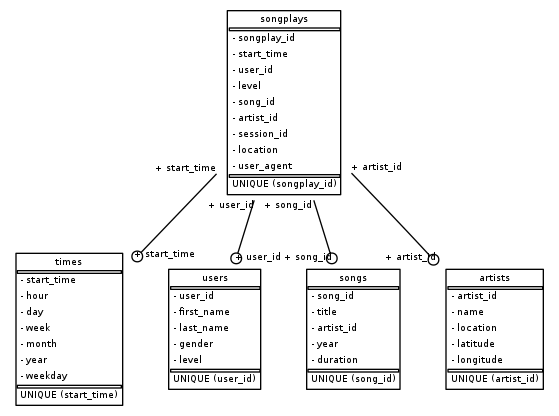

# Song Play ETL Project

## Summary

This project consists in:

1. Copying the below two datasets from S3 into staging tables in a Redshift data warehouse:
   * song data from a subset of the [Million Song Dataset](https://labrosa.ee.columbia.edu/millionsong/)
   * user activity logs from a music streaming app.
2. In the same Redshift data warehouse, combining these staging tables for analytics purposes using the following star schema:



##### Fact Table

1. songplays
   * records in log data associated with song plays i.e. records with page `NextSong`
     * *songplay_id, start_time, user_id, level, song_id, artist_id, session_id, location, user_agent*

##### Dimension Tables

1. times
   - timestamps of records in **songplays** broken down into specific units
     - *start_time, hour, day, week, month, year, weekday*
2. users
   * users in the app
     * *user_id, first_name, last_name, gender, level*
3. songs
   * songs in music database
     * *song_id, title, artist_id, year, duration*
4. artists
   * artists in music database
     * *artist_id, name, location, latitude, longitude*

## Files description

1. `requirements.txt` lists all packages used in the scripts of this repository.
2. `create-aws-resources.ipynb` creates (and deletes) the required resources on AWS (IAM role, EC2 security group and Redshift cluster) for running the scripts below. Since the data warehouse is created only for learning purposes, we want to keep the cluster running only while we are working on it and delete it when we are done in order not to incur unnecessary costs. 
3. `create_tables.py` drops and creates the relevant tables in the data warehouse. This script is used to reset tables before running the ETL script.
4. `sql_queries.py` contains all SQL queries used in this project for creating and droping tables as well as for inserting data into them.
5. `etl.py` reads and processes the datasets from S3 into staging tables in the data warehouse and, in turn, from the staging tables into analytics tables (see above star schema) within the data warehouse.
6. `test.ipynb` is for testing purposes.

## How to run this project

1. Make sure you have a configuration file `dwh.config` ready with your AWS credentials and the desired configuration of your cluster. Mine looks like the below:

   ```
   [AWS]
   key = paste_your_key_here
   secret = paste_your_secret_key_here
   
   [DWH]
   dwh_cluster_type = multi-node
   dwh_num_nodes = 4
   dwh_node_type = dc2.large
   dwh_cluster_identifier = dwhCluster
   host = to_be_filled_after_cluster_is_created
   dwh_db_name = dwh
   dwh_db_user = dwhuser
   dwh_db_password = pick_a_password_here
   dwh_port = 5439
   
   [IAM_ROLE]
   dwh_iam_role_name = dwhRole
   arn = to_be_filled_after_role_is_created
   
   [EC2]
   dwh_sec_group_name = redshift-sg
   
   [S3]
   log_data = 's3://udacity-dend/log_data'
   log_jsonpath = 's3://udacity-dend/log_json_path.json'
   song_data = 's3://udacity-dend/song_data'
   
   ```

2. Run the first part of `create-aws-resources.ipynb` to create the required AWS resources.

3. Run the scripts below via the terminal:

   ```bash
   python create_tables.py
   python etl.py
   ```

4. After the scripts have run, you can execute `test.ipynb` for testing purposes.

5. When you are done working on the cluster, run the last part of `create-aws-resources.ipynb` to delete the AWS resources created previously.